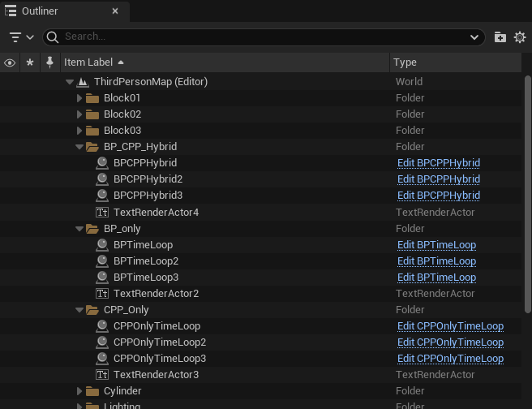
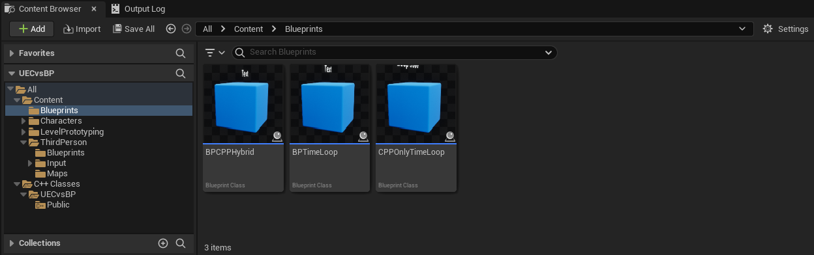
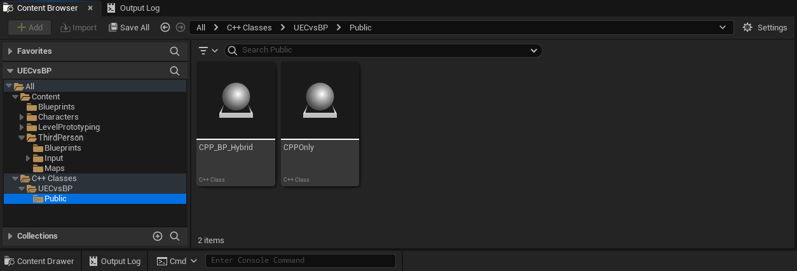

# Focus topic Unreal Engine C++ vs Blueprints
 
## Overview
This is an early Unreal Engine project, without a specific game mechanic. The goal for this demo is to demonstrate the three main types of scripting in Unreal Engine:
- Blueprint
- Blueprint Hybrid (Blueprints calling C++ functions)
- C++ 

You will see that we never entirely remove Blueprints from the creation of objects, but we can reduce their use. 

With each of the versions, we have rigged three simple trigger boxes that use a print statement and a for loop to print out the current loop index and the time taken to perform the loop. What is important to realise is that Blueprints are not inherently slow, but rather the connections between the nodes that cause the performance decrease. Note, we are in engine, so this is not fully reflective of the final build performance, but can guide you.

# Where to find the relevant scripts
You can find the relevent Blueprints in two main ways:

-Firstly, using the Outliner (Hierarchy in Unity), where I have created 3 folder for each of the script you should interact with, if you click Edit it will open the Blueprint. 

-Secondly, using the Content Browser (Project in Unity), go to Content->Blueprints and the Blueprint Classes (Similar to a Unity Prefab) are there. 

-Finally, you will find the C++ scripts also in the Content Browser C++ Classes->UECvsBP->Public. 

# Task 
The task for today is to play the scene and observe how the different scripting methods are interconnected within the engine. Likewise, see how the different techniques affect the system performance.

## Hints: 
Click play and run into the cubes ;) 
If you have a second monitor, use that to see the execution flow of the Blueprints. 

# Challenges
Test your might
## Easy 
- In the Blueprint Editor, highlight and copy (ctrl+c) the sequence of nodes. Paste (ctrl+v) into Notepad or Notepad++. This is the code behind the nodes, how they are positioned, what they are connected to, and the piece of C++ code they call.
- Adjust the loop counts, and see how it effects the performance. 
## Medium 
- Edit the Blueprints and the C++ with some basic functionality, such as the [Set Actor Location](https://dev.epicgames.com/documentation/en-us/unreal-engine/BlueprintAPI/Transformation/SetActorLocation) node or the matching SetActorLocation function in C++. 
- See if you can get it to move during the loop then reset back to the original position on the loop completion.
## Hard
- Using the provided scripts, try to translate Blueprints into C++, through the pipeline of Blueprint->Hybrid->C++. 
- This is a common optimisation step, done in most Unreal Engine based studios.

# Reference
Content is made by Connah Kendrick using the Unreal Engine 3rd Person Template for the MMU 1st year Game Mechanics Module taught to both Game Development and Game Design Students. 

